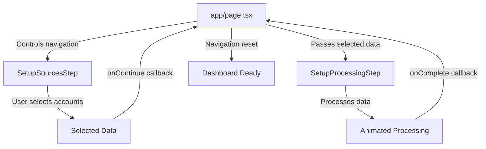

# Conversions Dashboard Architecture

## Overview
The Conversions Dashboard is a multi-step workflow for setting up data sources and creating conversion dashboards. It consists of two main steps that work together to provide a seamless setup experience.

## Current Architecture

### Component Structure

```
app/page.tsx (Main App Controller)
├── SetupSourcesStep (Step 1: Setup sources and select accounts)
└── SetupProcessingStep (Step 2: Setting up your dashboard)
```

### 1. **SetupSourcesStep Component** (`/components/setup-sources-step.tsx`)
**Purpose**: Allows users to select data sources and accounts for their conversion dashboard.

#### Key Features:
- **Data Source Selection**: Tree-based UI showing available data sources (Google Analytics, Facebook Ads, etc.)
- **Account Selection**: Hierarchical selection of connections and their associated accounts
- **Filtering**: Search and status filters (All, Connected, Disconnected)
- **Settings**: 
  - Date range picker for data fetching period
  - Auto-add new accounts toggle
- **Visual Feedback**: Icons, status badges, and selection counts

#### State Management:
```typescript
- selectedAccounts: string[] // IDs of selected accounts
- expandedConnections: string[] // IDs of expanded source items
- expandedDataConnections: string[] // IDs of expanded connection items
- searchQuery: string // Search filter
- statusFilter: "all" | "connected" | "disconnected"
- dateRange: { from?: Date; to?: Date } // Selected date range
- autoAddNewAccounts: boolean // Auto-add setting
```

#### Props Interface:
```typescript
interface SetupSourcesStepProps {
  onExit?: () => void
  onContinue?: (selectedSources: SelectedSourceData[], selectedAccountIds: string[]) => void
}
```

### 2. **SetupProcessingStep Component** (`/components/setup-processing-step.tsx`)
**Purpose**: Displays an animated processing flow that emulates the dashboard setup process.

#### Key Features:
- **Hierarchical Processing**: Sources → Connections → Substeps
- **Visual Progress**: 
  - Background progress bars for active items
  - Percentage indicators
  - Animated spinners
  - Step-by-step progression indicators
- **Auto-collapse**: Completed items automatically collapse
- **Expandable/Collapsible**: Users can interact during processing

#### Processing Flow:
1. Receives selected sources and accounts from ConversionsDashboard
2. Transforms data into processing structure with status tracking
3. Sequentially processes each substep:
   - Validating Connection
   - Syncing Accounts
   - Extracting Data
   - Processing Metrics
   - Setting Up Dashboard
4. Shows completion message when finished

#### State Management:
```typescript
- sources: SourceProcessing[] // Transformed source data with processing status
- currentSourceIndex: number // Currently processing source
- currentConnectionIndex: number // Currently processing connection
- currentSubstepIndex: number // Currently processing substep
- isProcessing: boolean // Overall processing state
- isCompleted: boolean // Completion state
```

#### Props Interface:
```typescript
interface SetupProcessingStepProps {
  selectedSources: SelectedSourceData[]
  selectedAccountsCount: number
  onComplete?: () => void
}
```

## Data Flow



## Current Implementation Status

### ✅ Working Features
1. **Component Separation**: Already properly separated into two distinct components
2. **Data Passing**: Clean data flow between components via props
3. **Visual Design**: Consistent styling using Tailwind CSS and shadcn/ui
4. **User Interaction**: Expandable/collapsible items, selection management
5. **Processing Animation**: Smooth, sequential processing with visual feedback
6. **Settings Integration**: Date range picker and auto-add toggle in footer

### 🎯 Areas for Improvement

#### 1. **Type Safety**
- **Issue**: Using `any[]` for selectedSources in SetupProcessingStep
- **Solution**: Create proper TypeScript interfaces for all data structures
```typescript
interface SelectedSourceData {
  source: Connection
  connections: DataSourceConnection[]
  accounts: Account[]
}
```

#### 2. **State Management**
- **Issue**: Complex state management spread across components
- **Solution**: Consider using Context API or Zustand for global state
```typescript
// Example with Context
const ConversionsDashboardContext = createContext<{
  selectedSources: SelectedSourceData[]
  dateRange: DateRange
  autoAddNewAccounts: boolean
}>()
```

#### 3. **Data Persistence**
- **Issue**: Settings and selections are lost on navigation
- **Solution**: Implement localStorage or sessionStorage persistence
```typescript
// Save selections
useEffect(() => {
  localStorage.setItem('conversionSettings', JSON.stringify({
    dateRange,
    autoAddNewAccounts,
    selectedAccounts
  }))
}, [dateRange, autoAddNewAccounts, selectedAccounts])
```

#### 4. **Error Handling**
- **Issue**: No error states or recovery mechanisms
- **Solution**: Add error boundaries and fallback UI
```typescript
interface ProcessingError {
  source: string
  connection?: string
  substep?: string
  message: string
}
```

#### 5. **Performance Optimization**
- **Issue**: Re-renders during processing animation
- **Solution**: Better memoization and optimization
```typescript
// Use React.memo more effectively
const MemoizedSourceCard = memo(SourceProcessingCard, (prev, next) => {
  // Custom comparison logic
})
```

#### 6. **Accessibility**
- **Issue**: Limited keyboard navigation and screen reader support
- **Solution**: Add ARIA labels, keyboard handlers, and focus management
```typescript
// Add keyboard navigation
onKeyDown={(e) => {
  if (e.key === 'Enter' || e.key === ' ') {
    toggleExpanded()
  }
}}
```

#### 7. **Real API Integration**
- **Issue**: Using mock data
- **Solution**: Create API service layer
```typescript
// API service
class ConversionsAPIService {
  async fetchDataSources(): Promise<Connection[]>
  async validateConnection(connectionId: string): Promise<boolean>
  async syncAccounts(connectionId: string): Promise<Account[]>
  async processData(params: ProcessingParams): Promise<void>
}
```

#### 8. **Progress Persistence**
- **Issue**: Processing state is lost on refresh
- **Solution**: Save processing progress to backend/localStorage
```typescript
interface ProcessingState {
  sessionId: string
  currentStep: ProcessingStep
  completedSteps: string[]
  timestamp: number
}
```

#### 9. **Customization Options**
- **Issue**: Fixed substeps for all sources
- **Solution**: Dynamic substeps based on source type
```typescript
const getSubstepsForSource = (sourceType: string): ProcessingStep[] => {
  switch(sourceType) {
    case 'google-analytics':
      return [...googleAnalyticsSteps]
    case 'facebook-ads':
      return [...facebookAdsSteps]
    default:
      return defaultSubsteps
  }
}
```

#### 10. **Testing**
- **Issue**: No test coverage
- **Solution**: Add unit and integration tests
```typescript
// Example test
describe('ConversionsDashboard', () => {
  it('should select all accounts when clicking select all', () => {
    // Test implementation
  })
  
  it('should filter sources based on search query', () => {
    // Test implementation
  })
})
```

## Recommended Refactoring

### Phase 1: Type Safety & State Management
1. Create comprehensive TypeScript interfaces
2. Implement Context API for shared state
3. Add proper error boundaries

### Phase 2: Performance & UX
1. Optimize re-renders with better memoization
2. Add keyboard navigation
3. Implement progress persistence

### Phase 3: API Integration
1. Create API service layer
2. Replace mock data with real endpoints
3. Add loading and error states

### Phase 4: Testing & Documentation
1. Add comprehensive test suite
2. Create Storybook stories for components
3. Document API contracts

## Component API Documentation

### SetupSourcesStep
```typescript
<SetupSourcesStep
  onExit={() => void}              // Called when user exits
  onContinue={(                    // Called when user continues
    sources: SelectedSourceData[],
    accountIds: string[]
  ) => void}
/>
```

### SetupProcessingStep
```typescript
<SetupProcessingStep
  selectedSources={SelectedSourceData[]}  // Selected source data
  selectedAccountsCount={number}          // Count of selected accounts
  onComplete={() => void}                 // Called when processing completes
/>
```

## File Structure
```
/components
  ├── setup-sources-step.tsx       # Step 1: Selection UI
  ├── setup-processing-step.tsx    # Step 2: Processing animation
  └── /ui                          # Shared UI components
      ├── button.tsx
      ├── calendar.tsx
      ├── checkbox.tsx
      ├── popover.tsx
      └── switch.tsx

/types
  └── step-interfaces.ts           # Shared type definitions

/app
  └── page.tsx                     # Main app controller
```

## Conclusion
The Conversions Dashboard is already well-structured with two separate components handling distinct responsibilities. The main areas for improvement focus on type safety, state management, and preparing for production use with real API integration and proper error handling.

The current implementation provides a solid foundation that can be enhanced incrementally without major architectural changes.
